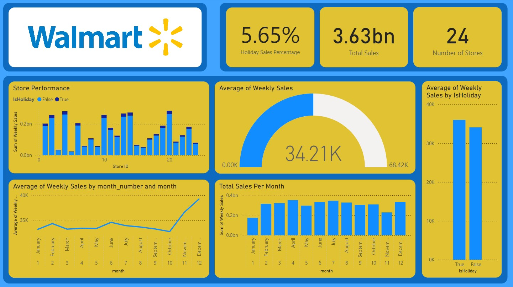

# E-commerce Growth Analysis at Walmart: Unveiling Holiday Sales Trends

Project Description

Walmart is the biggest retail store in the United States. Just like others, they have been expanding their e-commerce part of the business. By the end of 2022, e-commerce represented a roaring $80 billion in sales, which is 13% of total sales of Walmart. One of the main factors that affects their sales is public holidays, like the Super Bowl, Labour Day, Thanksgiving, and Christmas.

In this project, I worked with retail data from the multinational retail corporation Walmart. I retrieved data from the client in parquet format, prepared an ETL for the data, and finally loaded the data into the database PostgreSQL for Data Visualization in Power BI. I was tasked with creating a data pipeline for analyzing demand and supply around the holidays and running preliminary analyses of the data. Mastering data pipelines was essential for Data Engineers today, as it involved extracting, transforming, and loading data — a fundamental task that ensured information flowed smoothly. Also Mastering Data Visualization and Data Insights was the biggest part as a Data Analyst.
